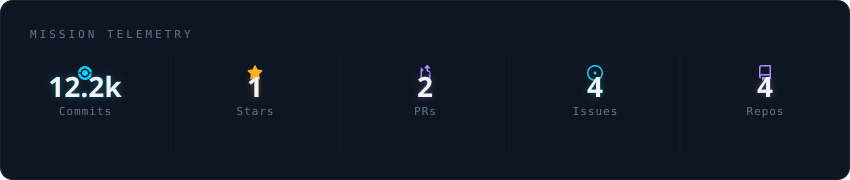

  

 

  

 

  

 

  

 

<strong>Mais sobre mim</strong>

 

Product Designer com 7 anos de experiencia em design de produto digital.
Meu diferencial: eu codifico o que projeto — Figma + React + TypeScript.

**Atualmente** AI Product Designer na SAT Bank — Minas Gerais, Brazil

### O que projeto

**App Bancario — SAT Bank** *(em producao)*
Design de produto para app bancario mobile. A/B testing com Statsig, monitoramento com Sentry, design system em React Native + Expo. Integro IA no processo de design com Claude Code e MCP.

**SaaS Multi-Tenant — Gestao Clinica** *(250k+ linhas, solo)*
Projetei e construi sozinho: agenda, financeiro, CRM, estoque, WhatsApp. Toda a UX/UI + implementacao. React + Next.js + TypeScript.

### Open Source

- [Cal.com #27636](https://github.com/calcom/cal.com/pull/27636) — fix(ui): change phone booking display *(merged)*
- [Cal.com #27637](https://github.com/calcom/cal.com/pull/27637) — fix: hide cancel/reschedule links in emails when disabled *(open)*

 

  
  
  

